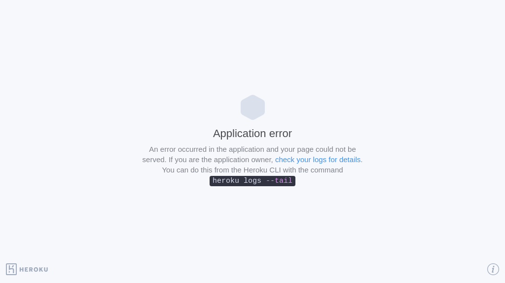

<!-- markdownlint-disable -->
<h1 align="center">
    best-of-workcell
    <br>
</h1>

<p align="center">
    <strong>🏆&nbsp; A ranked list of awesome workcell built by weanalyze.co and the community. Updated weekly.</strong>
</p>

<p align="center">
    <a href="https://best-of.org" title="Best-of Badge"></a>
    <a href="#Contents" title="Project Count"></a>
    <a href="#Contribution" title="Contributions are welcome"></a>
    <a href="https://github.com/weanalyze/best-of-workcell/releases" title="Best-of Updates"></a>
</p>

This curated list contains 7 awesome open-source projects with a total of 150 stars grouped into 10 categories. All projects are ranked by a project-quality score, which is calculated based on various metrics automatically collected from GitHub and different package managers. If you like to add or update projects, feel free to open an [issue](https://github.com/weanalyze/best-of-workcell/issues/new/choose), submit a [pull request](https://github.com/weanalyze/best-of-workcell/pulls), or directly edit the [projects.yaml](https://github.com/weanalyze/best-of-workcell/edit/main/projects.yaml). Contributions are very welcome!

> 🧙‍♂️  Discover other [best-of lists](https://best-of.org) or [create your own](https://github.com/best-of-lists/best-of/blob/main/create-best-of-list.md).

[🎈 Official Demos](#-official-demos) | [🧬 Science & Technology](#-science--technology) | [📈 Business Intelligence](#-business-intelligence) | [💰 Finance](#-finance) | [🤖 General Machine Learning](#-general-machine-learning) | [📚 Natural Language Processing](#-natural-language-processing) | [👁️ Computer Vision](#-computer-vision) | [🎵 Audio](#-audio) | [🚀 Non-ML Apps](#-non-ml-apps) | [🪐 Extensions & Components](#-extensions--components) | [Others](#others)

<br>

## 🎈 Official Demos

<a href="#"></a>

<br>

## 🧬 Science & Technology

<a href="#"></a>

<br>

## 📈 Business Intelligence

<a href="#"></a>

<table width="100%"><tr align="center"><td valign="top" width="33.3%"><br><a href="https://jiandong-gurobi-tsp.hf.space"></a><br><h3><a href="https://jiandong-gurobi-tsp.hf.space">Gurobi TSP demo</a></h3><p>{}</p><p><sup>by <a href="https://github.com/jiandong">@jiandong</a></sup></p></td></tr></table>

<br>

## 💰 Finance

<a href="#"></a>

<br>

## 🤖 General Machine Learning

<a href="#"></a>

<table width="100%"><tr align="center"><td valign="top" width="33.3%"><br><a href="https://jiandong-model-serving-t5.hf.space"></a><br><h3><a href="https://jiandong-model-serving-t5.hf.space">Huggingface Model Serving</a></h3><p>{}</p><p><sup>by <a href="https://github.com/jiandong">@jiandong</a></sup></p></td></tr></table>

<br>

## 📚 Natural Language Processing

<a href="#"></a>

<br>

## 👁️ Computer Vision

<a href="#"></a>

<br>

## 🎵 Audio

<a href="#"></a>

<br>

## 🚀 Non-ML Apps

<a href="#"></a>

<br>

## 🪐 Extensions & Components

<a href="#"></a>

<table width="100%"><tr align="center"><td valign="top" width="33.3%"><br><a href="https://streamlit-observable.herokuapp.com/"></a><br><h3><a href="https://streamlit-observable.herokuapp.com/">Observable</a></h3><p>⭐ 82 · <a href="https://github.com/asg017/streamlit-observable">:octocat: Code</a></p><p>Embed Observable notebooks into Streamlit apps!</p><p><sup>by <a href="https://github.com/asg017">@asg017</a></sup></p></td><td valign="top" width="33.3%"><br><a href="https://github.com/andfanilo/streamlit-d3-demo"></a><br><h3><a href="https://github.com/andfanilo/streamlit-d3-demo">D3 Demo</a></h3><p>⭐ 66 · <a href="https://github.com/andfanilo/streamlit-d3-demo">:octocat: Code</a></p><p>D3 in React in Streamlit tech demo</p><p><sup>by <a href="https://github.com/andfanilo">@andfanilo</a></sup></p></td><td valign="top" width="33.3%"><br><a href="https://jiandong-hello-plotly.hf.space/ui"></a><br><h3><a href="https://jiandong-hello-plotly.hf.space/ui">Plotly Demo</a></h3><p>{}</p><p><sup>by <a href="https://github.com/jiandong">@jiandong</a></sup></p></td></tr></table>

<br>

## Others

<a href="#"></a>

<table width="100%"><tr align="center"><td valign="top" width="33.3%"><br><a href="https://jiandong-hello-plotly.hf.space/ui"></a><br><h3><a href="https://jiandong-hello-plotly.hf.space/ui">Stocks - SEC Form</a></h3><p>{}</p><p><sup>by <a href="https://github.com/jiandong">@jiandong</a></sup></p></td><td valign="top" width="33.3%"><br><a href="https://jiandong-economy-available-indices.hf.space/ui"></a><br><h3><a href="https://jiandong-economy-available-indices.hf.space/ui">Economy - Avalable Indicies</a></h3><p>{}</p><p><sup>by <a href="https://github.com/jiandong">@jiandong</a></sup></p></td></tr></table>


---

## 📬 Contributing

Built or discovered a new workcell app? I'd love to have it in this list! You can 
either:

- [Open an issue](https://github.com/weanalyze/best-of-workcell/issues/new/choose) with 
a link to the app/repo
- Add the app yourself by [editing projects.yaml directly online](https://github.com/weanalyze/best-of-workcell/edit/main/projects.yaml) 
(no forking required). Just add the following information at the end of this file:

    ```yaml
    - name: App Name  # required; keep it short
      homepage: link/to/deployment  # required; if not deployed, give repo link
      image: link/to/gif/png/jpg  # optional; if not given, will take screenshot of homepage
      github_id: owner/repo  # optional
      category: one of the categories below  # required
      show: True # optional; If True, the project will always be shown even when the project would be actual hidden
    ```

    For `category`, choose one from below (e.g. `ml`) or leave empty if you are not 
    sure:
 
    ```yaml
    - category: demo
      title: 🎈 Official Demos
    - category: sci-tech
      title: 🧬 Science & Technology
    - category: bi
      title: 📈 Business Intelligence
    - category: fin
      title: 💰 Finance
    - category: ml
      title: 🤖 General Machine Learning
    - category: nlp
      title: 📚 Natural Language Processing
    - category: cv
      title: 👁️ Computer Vision
    - category: audio
      title: 🎵 Audio
    - category: non-ml
      title: 🚀 Non-ML Apps
    - category: extension
      title: 🪐 Extensions & Components
    ```

    *Note: The new app will not show up in the gallery directly. I first need to 
    re-generate the README.md file from projects.yaml after your changes are merged.*

- If you want to suggest any other change, feel free to [open an issue](https://github.com/weanalyze/best-of-workcell/issues/new/choose) 
as well :)

<br>

## Related Resources

- [**Best-of lists**](https://best-of.org): Discover other best-of lists with awesome open-source projects on all kinds of topics.

## License

[](https://creativecommons.org/licenses/by-sa/4.0/)
